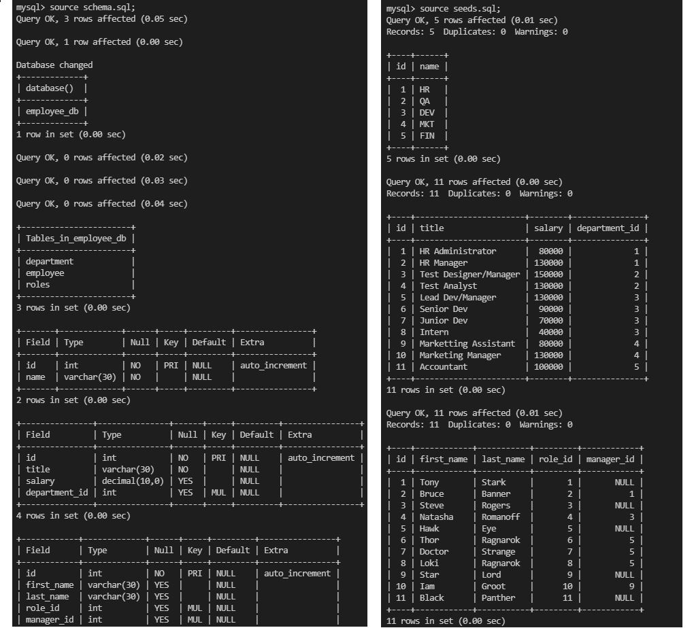
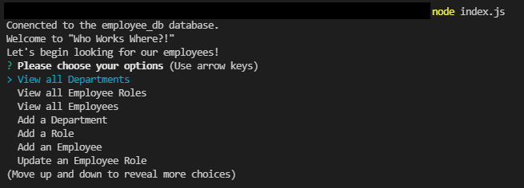

# WWW: Who Works Where? 

## License
  [](https://opensource.org/licenses/MIT)

## Table of Contents

[Description](#description)

[Installation](#installation)

[Usage](#usage)

[Test](#test)

[Demo](#demo)

[Screenshot](#screenshot)

[Contributors](#contributors)

## Description

This application is a Content Management System that utilizes Command Line Interface. You can view your company's departments, roles and employees with this application. 

Current Features of this application includes: 
 - View Departments 
 - View Roles 
 - View Employees 
 - Add Department 
 - Add Role 
 - Add Employee 
 - Update Employee Role
 - Quit

## Installation
This application was made using JavaScript, mySQL, Node JS, and NPM 

  For Installation, you are required the following:
  - Node JS 
  - mySQL 
  - IDE of Choice with Terminal/Console
  
  Additional packages required are: 
  - Node Packet Manager(NPM):
    - NPM [Inquirer package](https://www.npmjs.com/package/inquirer)
    - NPM [mysql2](https://www.npmjs.com/package/mysql2)
    - NPM [console.table](https://www.npmjs.com/package/console.table)

  You can install the above required packages by entering following on the terminal/node:
  ```
    npm init -y 
    npm install
  ```

## Usage
This application is not deployed currently as it does not have a front end. However, you are still able to use this application by cloning or forking my repository and running the files on your IDE, Terminal, Console, Node or Powershell. 

Then, you will be required to input your mySQL password at the index.js file on line 12 where it says "ENTER YOUR PASSWORD".

```
//create connection to sql
const connection = mysql.createConnection({
    host: 'localhost',
    port: '3306', //default port for mysql protocol
    user: 'root',
    password: "ENTER YOUR PASSWORD"
    database: 'employee_db'
},
    console.log(`Conencted to the employee_db database.`)
);
```

Then you will be required to run the schema.sql and seeds.sql in mySQL console. (See Screenshot 1)
```
mySQL -u root -p "ENTER YOUR PASSWORD"

source schema.sql;
source seeds.sql;
```

Then run the index.js file in a different console and start the application by: 

  ```
    node index.js
  ```

## Test

No testing was done for this project please feel free to add the feature or contact me. 

## Demo

Demo Video available [here]()

## Screenshot



## Contribution

Joe Lee 

Got any questions or want to contribute to this project? 

Contact me via: 

  - [Jollypong](https//:github.com/Jollypong) 

  - Email: joeleegc@gmail.com

## 